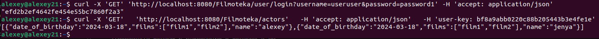

# Filmoteka_server

Проект написан из спецификации swagger 2.0. Используется подход api-first

Версия go - 1.22

Версия postgres - 16

Так же присутствует Makefile:
Цели:
- 1. run_service - запуск сервера
- 2. compose - запуск docker-compose
- 3. test - для запуска тестов

# Конфигурация базы данных

Для работы с базой данных используется пакет gorm

В базе данных присутствует 4 таблицы:
actor - хранит актеров
films - хранит фильмы
actors_films - связывает фильмы и актеров
users - хранит пользователей(Сервер кроме Login не предоставляет операции с данной таблицей). В ней прописаны два пользователя с ролями isUser, isAdmin

# Первый запуск

При первом запуске сервера будут автоматически созданы все таблицы из базы данных.
Данные заносятся через sql скрипт

# Основные операции
Проект filmoteka позволяет пользователям хранить информацию о фильмах и актерах, а так же получать эту информацию по запросу. В качестве хранилища данных используется БД PostgreSQL.

Проект запускается в докер контейнерах: предоставлен dockerfile, docker-compose для сборки проекта в докере. Так же предоставлен скрипт, который ожидает полного включения базы данных в контейнере перед запуском контейнера с приложением.

Имеется два типа пользователь. Сначало нужно аутентифицироваться по пути Filmoteka/user/login
Обычный Пользователь может совершать GET запросы.
Пользователь с правами администратора может совершать любые доступные запросы.

### Запросы на получение данных:
- 1.Осуществлять поиск актеров по имени актера
- 2.Получать из БД список актеров и список фильмов с их участием
- 3.Получать информацию о фильмах по фрагменту названия фильма и фрагменту имени актера
- 4.Получать список фильмов из БД с возможностью сортировки по названию, рейтингу, дате выпуска

### Запросы модифицирующие данные

- 1.Добавлять информацию в БД об актерах (имя, пол, дата рождения)
- 2.Изменять информацию об актерах (любое из полей или несколько полей)
- 3.Удалять информацию об актере
- 4.Добавлять фильмы и информацию о фильмах в БД 
- 5.Изменять информацию о фильмах (любое из полей или несколько полей)
- 6.А так же функции, доступные пользователям без аутентификации

Алгоритм установки и запуска проекта: Проект упакован в два докер - контейнера:

База данных
База данных PostgreSQL. Сервер работает только с одной БД.

При первом запуске проекта путем автомиграции будет создана структура БД. Между таблицами "actors" и "films" установлена связь many-to-many с использованием вспомагательной таблицы "actors_films".

Логирование
Для логирования используется пакет slog. Вся информация логируется в файле ./logs/log.txt. Логируются все входящие запросы. Пример:

time=2024-03-18T20:34:24.087+03:00 level=INFO msg="Serving filmoteka at http://%s" !BADKEY=[::]:8080

time=2024-03-18T20:34:26.398+03:00 level=INFO msg="Request status" component=middleware/logger Path=/Filmoteka/actors Method=GET status_code=401 elapsed_time=101.972µs

time=2024-03-18T20:34:28.693+03:00 level=INFO msg="Request status" component=middleware/logger Path=/Filmoteka/actors Method=GET status_code=401 elapsed_time=71.101µs

time=2024-03-18T20:34:30.776+03:00 level=INFO msg="Shutting down... "

time=2024-03-18T20:34:30.776+03:00 level=INFO msg="Stopped serving filmoteka at http://%s" !BADKEY=[::]:8080

Unit тесты
Тесты написаны с пакетами. 	
- 1. "github.com/DATA-DOG/go-sqlmock"
- 2. "github.com/stretchr/testify/assert"

### Пример запроса

